# Unified Theme System Architecture

This document explains how the unified theme system works across web (MUI) and mobile (Tamagui) platforms in the Safe Wallet monorepo.

## Overview

The `@safe-global/theme` package serves as a **single source of truth** for design tokens (colors, spacing, typography, radius) across both web and mobile applications. It provides:

- **Unified color palettes** (light, dark, static)
- **Platform-specific generators** (MUI for web, Tamagui for mobile, CSS variables for web)
- **Dual spacing systems** (4px base for mobile, 8px base for web)
- **Platform-specific color overrides** (web uses different tints than mobile)

## Architecture Diagram

```mermaid
flowchart TB
    subgraph palettes["📦 Source Palettes"]
        LP["Light Palette
        palettes/light.ts"]
        DP["Dark Palette
        palettes/dark.ts"]
        SP["Static Colors
        palettes/static.ts"]
    end

    subgraph tokens["🎨 Tokens"]
        T1["Typography"]
        T2["Spacing"]
        T3["Radius"]
    end

    subgraph generators["⚙️ Platform Generators"]
        MUI["MUI Generator
        generateMuiTheme"]
        TAMA["Tamagui Generator
        generateTamaguiTokens"]
        CSS["CSS Vars Generator
        generateCSSVars"]
    end

    subgraph overrides["🎯 Web Overrides"]
        WO["Color Overrides
        info, success, warning"]
    end

    subgraph output["📱 Platform Themes"]
        WT["Web Theme
        MUI Theme Object"]
        MT["Mobile Theme
        Tamagui Config"]
        CV["CSS Variables
        vars.css"]
    end

    subgraph apps["🚀 Applications"]
        WEB["Web App
        Next.js + MUI"]
        MOB["Mobile App
        Expo + Tamagui"]
    end

    LP --> MUI
    DP --> MUI
    SP --> MUI
    LP --> TAMA
    DP --> TAMA
    SP --> TAMA
    LP --> CSS
    DP --> CSS
    SP --> CSS

    T1 --> MUI
    T1 --> TAMA
    T2 --> MUI
    T2 --> TAMA
    T3 --> MUI
    T3 --> TAMA

    WO --> MUI
    WO --> CSS

    MUI --> WT
    TAMA --> MT
    CSS --> CV

    WT --> WEB
    CV --> WEB
    MT --> MOB

    style WO fill:#ffeb99,stroke:#ff9900,stroke-width:2px
    style LP fill:#e1f5ff,stroke:#0288d1
    style DP fill:#424242,stroke:#212121,color:#fff
    style SP fill:#f3e5f5,stroke:#7b1fa2
```



## Directory Structure

```
packages/theme/
├── src/
│   ├── palettes/
│   │   ├── light.ts          # Unified light mode palette
│   │   ├── dark.ts           # Unified dark mode palette
│   │   ├── static.ts         # Theme-independent brand colors
│   │   └── types.ts          # TypeScript color palette types
│   ├── tokens/
│   │   ├── typography.ts     # Font family, sizes, weights
│   │   ├── spacing.ts        # Mobile (4px) & Web (8px) spacing
│   │   └── radius.ts         # Border radius scale
│   ├── generators/
│   │   ├── mui.ts            # MUI theme generator (web)
│   │   ├── tamagui.ts        # Tamagui theme generator (mobile)
│   │   ├── css-vars.ts       # CSS variables generator (web)
│   │   └── mui-extensions.ts # MUI TypeScript type extensions
│   └── index.ts              # Public API exports
├── package.json
├── tsconfig.json
└── README.md
```

## How Theme Generation Works

### 1. Source Palettes (Base)

The unified palettes in `packages/theme/src/palettes/` define colors that are **mostly shared** between platforms:

```typescript
// packages/theme/src/palettes/light.ts
const lightPalette: ColorPalette = {
  text: { primary: '#121312', secondary: '#A1A3A7', ... },
  primary: { dark: '#3c3c3c', main: '#121312', light: '#636669' },
  success: { dark: '#1C5538', main: '#00B460', ... }, // Mobile colors
  info: { dark: '#15566A', main: '#00BFE5', ... },    // Mobile colors
  warning: { dark: '#6C2D19', main: '#FF8C00', ... }, // Mobile colors
  // ...
}
```

**Important**: The base palettes use **mobile's color values** for `info`, `success`, and `warning`.

### 2. Web Generator with Platform Overrides

The MUI generator (`packages/theme/src/generators/mui.ts`) applies **web-specific overrides** for colors that differ from mobile:

```typescript
export function generateMuiTheme(mode: PaletteMode): Theme {
  const isDarkMode = mode === 'dark'
  const colors = isDarkMode ? darkPalette : lightPalette

  return createTheme({
    palette: {
      mode: isDarkMode ? 'dark' : 'light',
      ...colors,

      // Web-specific color overrides (different tints than mobile)
      ...(isDarkMode
        ? {
            success: { dark: '#388E3C', main: '#00B460', light: '#81C784', background: '#1F2920' },
            info: { dark: '#52BFDC', main: '#5FDDFF', light: '#B7F0FF', background: '#19252C' },
            warning: { dark: '#C04C32', main: '#FF8061', light: '#FFBC9F', background: '#2F2318' },
          }
        : {
            success: { dark: '#028D4C', main: '#00B460', light: '#D3F2E4', background: '#EFFAF1' },
            info: { dark: '#52BFDC', main: '#5FDDFF', light: '#D7F6FF', background: '#EFFCFF' },
            warning: { dark: '#C04C32', main: '#FF8061', light: '#FFBC9F', background: '#FFF1E0' },
          }),
    },
    // ... typography, spacing, component overrides
  })
}
```

### 3. CSS Variables Generator

The CSS variables generator (`packages/theme/src/generators/css-vars.ts`) also applies web-specific overrides:

```typescript
export function generateCSSVars(): string {
  // Apply web-specific color overrides
  const webLightPalette: ColorPalette = {
    ...lightPalette,
    success: {
      /* web colors */
    },
    info: {
      /* web colors */
    },
    warning: {
      /* web colors */
    },
  }

  const webDarkPalette: ColorPalette = {
    ...darkPalette,
    success: {
      /* web colors */
    },
    info: {
      /* web colors */
    },
    warning: {
      /* web colors */
    },
  }

  // Generate CSS custom properties
  const lightVars = flattenPaletteToCSS(webLightPalette)
  const darkVars = flattenPaletteToCSS(webDarkPalette)

  // Output as :root and [data-theme="dark"] rules
}
```

### 4. Tamagui Generator (Mobile)

The Tamagui generator (`packages/theme/src/generators/tamagui.ts`) uses the base palettes **without overrides**:

```typescript
export function generateTamaguiTokens() {
  return {
    color: {
      ...flattenPalette(lightPalette, { suffix: 'Light' }),
      ...flattenPalette(darkPalette, { suffix: 'Dark' }),
    },
    // ... other tokens
  }
}
```

Mobile uses the colors from the unified palettes directly.

## Color Divergences Between Platforms

The following colors have **different tints** between web and mobile:

### Light Mode Divergences

| Color                  | Component           | Web (Original)               | Mobile (Unified Base)              | Reason                         |
| ---------------------- | ------------------- | ---------------------------- | ---------------------------------- | ------------------------------ |
| **error.dark**         | Dark error shade    | `#AC2C3B` (medium red)       | `#8A1C27` (darker, less saturated) | Mobile uses darker shades      |
| **error.light**        | Light error shade   | `#FFB4BD` (light pink)       | `#F79BA7` (different light pink)   | Different tint preferences     |
| **error.background**   | Error background    | `#FFE6EA` (very light pink)  | `#FFE0E6` (slightly different)     | Web prefers warmer tints       |
| **info.main**          | Main info color     | `#5FDDFF` (bright cyan)      | `#00BFE5` (darker cyan)            | Different design language      |
| **info.dark**          | Dark info shade     | `#52BFDC`                    | `#15566A` (much darker, teal-ish)  | Web uses brighter tints        |
| **info.light**         | Light info shade    | `#D7F6FF` (very light blue)  | `#78D2E7` (medium blue)            | Web has lighter backgrounds    |
| **info.background**    | Info background     | `#EFFCFF` (almost white)     | `#CEF0FD` (more saturated)         | Web prefers subtle backgrounds |
| **success.dark**       | Dark success shade  | `#028D4C` (bright green)     | `#1C5538` (darker, desaturated)    | Mobile uses darker shades      |
| **success.light**      | Light success shade | `#D3F2E4` (very light green) | `#84D9A0` (medium green)           | Web has lighter backgrounds    |
| **success.background** | Success background  | `#EFFAF1` (almost white)     | `#CBF2DB` (more saturated)         | Web prefers subtle backgrounds |
| **warning.main**       | Main warning color  | `#FF8061` (coral/salmon)     | `#FF8C00` (pure orange)            | Web uses softer, coral tones   |
| **warning.dark**       | Dark warning shade  | `#C04C32` (reddish-orange)   | `#6C2D19` (dark brown)             | Mobile uses very dark shades   |
| **warning.light**      | Light warning shade | `#FFBC9F` (light coral)      | `#F9B37C` (peachy)                 | Different color temperature    |
| **warning.background** | Warning background  | `#FFF1E0` (cream)            | `#FFECC2` (yellow-orange)          | Web uses warmer, softer tones  |

### Dark Mode Divergences

| Color                  | Component           | Web (Original)              | Mobile (Unified Base)          | Reason                                 |
| ---------------------- | ------------------- | --------------------------- | ------------------------------ | -------------------------------------- |
| **error.dark**         | Dark error shade    | `#AC2C3B` (medium red)      | `#FFE0E6` (very light pink!)   | Mobile inverts dark/light in dark mode |
| **error.light**        | Light error shade   | `#FFB4BD` (light pink)      | `#4A2125` (very dark!)         | Web keeps semantic meaning             |
| **error.background**   | Error background    | `#2F2527` (dark brown-red)  | `#4A2125` (slightly lighter)   | Different background strategies        |
| **info.main**          | Main info color     | `#5FDDFF` (bright cyan)     | `#00BFE5` (darker cyan)        | Consistent with light mode             |
| **info.dark**          | Dark info shade     | `#52BFDC` (bright)          | `#D9F4FB` (very light)         | Mobile inverts dark/light in dark mode |
| **info.light**         | Light info shade    | `#B7F0FF` (light)           | `#458898` (dark)               | Web keeps semantic meaning             |
| **info.background**    | Info background     | `#19252C` (dark blue-gray)  | `#203339` (slightly lighter)   | Different background strategies        |
| **success.dark**       | Dark success shade  | `#388E3C` (medium green)    | `#DEFDEA` (very light green)   | Mobile inverts dark/light in dark mode |
| **success.light**      | Light success shade | `#81C784` (light green)     | `#3B7A54` (dark green)         | Web keeps semantic meaning             |
| **success.background** | Success background  | `#1F2920` (dark green-gray) | `#173026` (slightly different) | Different background strategies        |
| **warning.main**       | Main warning color  | `#FF8061` (coral)           | `#FF8C00` (pure orange)        | Consistent with light mode             |
| **warning.dark**       | Dark warning shade  | `#C04C32` (reddish-orange)  | `#FFE4CB` (very light)         | Mobile inverts dark/light in dark mode |
| **warning.light**      | Light warning shade | `#FFBC9F` (light coral)     | `#A65F34` (dark brown)         | Web keeps semantic meaning             |
| **warning.background** | Warning background  | `#2F2318` (dark brown)      | `#4A3621` (lighter brown)      | Different background strategies        |

### Key Insights

1. **Semantic Consistency (Web)**: Web maintains semantic meaning where `.dark` is always darker than `.main` and `.light` is always lighter, regardless of light/dark mode.

2. **Inversion Pattern (Mobile)**: Mobile inverts the `.dark` and `.light` shades in dark mode - `.dark` becomes light (for text/foreground), `.light` becomes dark (for backgrounds).

3. **Tint Philosophy**:
   - **Web**: Softer, more pastel tints with subtle backgrounds
   - **Mobile**: More saturated colors with stronger contrast

4. **Color Temperature**:
   - **Web warning**: Coral/salmon tones (warmer, softer)
   - **Mobile warning**: Pure orange (more saturated)

5. **Main Color Alignment**: `success.main` is shared (`#00B460`), but `error.main`, `info.main`, and `warning.main` differ between platforms.

6. **Total Divergences**: **28 color property differences** (14 in light mode + 14 in dark mode) across 4 color groups: error, info, success, and warning.

## Why This Architecture?

### Before: Duplicated Palettes

Previously, web and mobile had **separate, duplicated palette files**:

```
apps/web/src/components/theme/lightPalette.ts
apps/web/src/components/theme/darkPalette.ts
apps/mobile/src/theme/palettes/lightPalette.ts
apps/mobile/src/theme/palettes/darkPalette.ts
```

**Problems**:

- Color definitions were duplicated
- Changes had to be made in multiple places
- Colors drifted between platforms over time
- No single source of truth

### After: Unified with Platform Overrides

Now there's **one set of palettes** with platform-specific overrides:

```
packages/theme/src/palettes/light.ts        (single source)
packages/theme/src/palettes/dark.ts         (single source)
packages/theme/src/generators/mui.ts        (web overrides)
packages/theme/src/generators/css-vars.ts   (web overrides)
packages/theme/src/generators/tamagui.ts    (uses base directly)
```

**Benefits**:

- Single source of truth for most colors
- Platform-specific overrides are explicit and documented
- Changes to shared colors propagate automatically
- Type-safe with shared TypeScript interfaces

## How to Modify Colors

### Changing Shared Colors (Affects Both Platforms)

Edit the unified palettes:

```typescript
// packages/theme/src/palettes/light.ts
const lightPalette: ColorPalette = {
  primary: { main: '#NEW_COLOR' }, // Changes both web and mobile
}
```

Then regenerate CSS vars for web:

```bash
yarn workspace @safe-global/web css-vars
```

### Changing Web-Only Colors

Edit the platform overrides in generators:

```typescript
// packages/theme/src/generators/mui.ts
export function generateMuiTheme(mode: PaletteMode): Theme {
  return createTheme({
    palette: {
      ...colors,
      info: { main: '#NEW_WEB_COLOR' }, // Only affects web
    },
  })
}

// packages/theme/src/generators/css-vars.ts
export function generateCSSVars(): string {
  const webLightPalette: ColorPalette = {
    ...lightPalette,
    info: { main: '#NEW_WEB_COLOR' }, // Only affects web CSS vars
  }
}
```

### Changing Mobile-Only Colors

Edit the base palette (since mobile uses it directly):

```typescript
// packages/theme/src/palettes/light.ts
const lightPalette: ColorPalette = {
  info: { main: '#NEW_MOBILE_COLOR' }, // Changes mobile
}
```

Then add web override to keep web unchanged:

```typescript
// packages/theme/src/generators/mui.ts
info: { main: '#OLD_WEB_COLOR' }, // Preserve web color
```

## Usage in Applications

### Web (MUI)

```typescript
// apps/web/src/components/theme/safeTheme.ts
import { generateMuiTheme } from '@safe-global/theme'

export const lightTheme = generateMuiTheme('light')
export const darkTheme = generateMuiTheme('dark')
```

Components use theme via MUI's theme system:

```typescript
import { useTheme } from '@mui/material'

function MyComponent() {
  const theme = useTheme()
  return <Box bgcolor={theme.palette.info.main}>...</Box>
}
```

Or via CSS variables:

```css
.my-element {
  color: var(--color-info-main);
  background: var(--color-info-background);
}
```

### Mobile (Tamagui)

```typescript
// apps/mobile/src/theme/tamagui.config.ts
import { generateTamaguiTokens, generateTamaguiThemes } from '@safe-global/theme'

const tokens = generateTamaguiTokens()
const themes = generateTamaguiThemes()

export default createTamagui({
  tokens,
  themes,
  // ...
})
```

Components use theme via Tamagui:

```typescript
import { YStack } from 'tamagui'

function MyComponent() {
  return <YStack backgroundColor="$successMainLight">...</YStack>
}
```

## Testing

Run tests for the theme package:

```bash
yarn workspace @safe-global/theme test
```

Regenerate CSS variables after palette changes:

```bash
yarn workspace @safe-global/web css-vars
```

Run type checking:

```bash
yarn workspace @safe-global/theme type-check
```

## Summary

The unified theme system provides:

- ✅ **Single source of truth** for design tokens
- ✅ **Platform-specific generators** for MUI, Tamagui, and CSS variables
- ✅ **Explicit color overrides** for web's different tints
- ✅ **Type safety** across the entire system
- ✅ **Automatic propagation** of shared color changes
- ✅ **Clear documentation** of platform divergences

This architecture balances **code reuse** with **platform-specific design requirements**.
